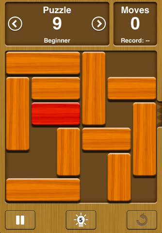

# unblockme

A Python package that solves unblockme puzzles for you

To install:
```
pip install unblockme
```

Example puzzle:



Example State Representation:

* each block is represented by a letter
* the Red target block is represented by an X

```
state = '''
AAAB  
CDDBEE
CXXB F
C GHHF
  G IF
JJJ I
'''

```

Example Usage:

```
from unblockme import unblockme

state = '''
AAAB  
CDDBEE
CXXB F
C GHHF
  G IF
JJJ I
'''

unblockme(state)

# watch the solution get animated in front of you
```
